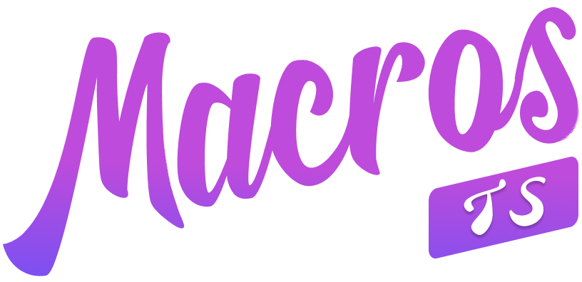

<p align="center">
  
</p>

# TS Macro

<a href="https://npmjs.com/package/ts-macro">
  
</a>

This is a VSCode plugin for define TS(X) macro powered by [Volar.js](https://github.com/volarjs/volar.js).

## Usage

1. Install the [VSCode Plugin](https://marketplace.visualstudio.com/items?itemName=zhiyuanzmj.vscode-ts-macro), or use a [REPL](https://repl.zmjs.dev) that supports ts-macro.

2. Create `tsm.config.ts` at the same level of `tsconfig.json`.
   > `TS Macro` supports automatic registration of Volar plugins from vite.config.ts, similar to `xxx.d.ts`. \
     For plugin authors, you need to export a `volar` file, and `TS Macro` will automatically load the plugin and share userOptions with the vite plugin. [Example](https://github.com/zhiyuanzmj/unplugin-vue-reactivity-function/tree/main/src). \
     For plugin users, you only need to install the `TS Macro` VSCode plugin, and there's no need to write tsm.config.ts.

3. Writing your first plugin.

   ```ts
   // tsm.config.ts
   export default {
     plugins: [
       {
         name: 'ts-macro-define-style',
         resolveVirtualCode({ codes }) {
           // declare the `defineStyle` function type for every TS(X) files.
           codes.push('declare function defineStyle<T>(style: string): T ')
         },
       },
     ],
   }
   ```

   Or You can use `createPlugin` to define plugin. also compatibility with [@vue/language-tools](https://github.com/vuejs/language-tools) plugin.

   ```ts
   // tsm.config.ts
   import { createPlugin, replaceSourceRange } from 'ts-macro'

   const defineStylePlugin = createPlugin<{ macro: string } | undefined>(
     (
      { 
        ts, 
        compilerOptions, 
        vueCompilerOptions // only useful in '@vue/language-tools'
      }, 
      userOptions = vueCompilerOptions?.defineStyle ?? { macro: 'defineStyle' } // default options
    ) => {
       return {
         name: 'ts-macro-define-style',
         resolveVirtualCode({ ast, codes, source }) {
           codes.push(
             `declare function ${userOptions.macro}<T>(style: string): T `,
           )

           ts.forEachChild(ast, walk)

           function walk(
             node: import('typescript').Node,
           ) {
             ts.forEachChild(node, walk)

             if (
               ts.isCallExpression(node) &&
               node.expression.getText(ast) === userOptions.macro
             ) {
               // add generic type for defineStyle.
               // if your plugin don't support vue file, you can use replaceRange instead.
               replaceSourceRange(
                 codes,
                 // in vue file will be 'script' | 'scriptSetup', in ts file will be undefined.
                 source,
                 node.arguments.pos - 1,
                 node.arguments.pos - 1,
                 // should be use regex to generate type, for simple use string instead.
                 '<{ foo: string }>',
               )
             }
           }
         },
       }
     },
   )

   export default {
     plugins: [
       defineStylePlugin({
         macro: 'defineStyle',
       }),
     ],
   }
   ```

4. Result
   
   

> Full implementation: [define-style](https://github.com/vuejs/vue-jsx-vapor/blob/main/packages/macros/src/volar/define-style.ts)

## TSC

Use `tsmc` instead of `tsc` to compile TS.

Install

```sh
pnpm add @ts-macro/tsc -D
```

Usage in package.json.

```json
{
  "scripts": {
    "typecheck": "tsmc --noEmit"
  }
}
```

## References

Thanks for these great projects, I have learned a lot from them.

- https://github.com/volarjs/volar.js
- https://github.com/vue-vine/vue-vine
- https://kermanx.github.io/reactive-vscode
- https://github.com/vue-macros/vue-macros

## Who are using ts-macro

- https://github.com/vuejs/vue-jsx-vapor
- https://github.com/vue-macros/vue-macros
